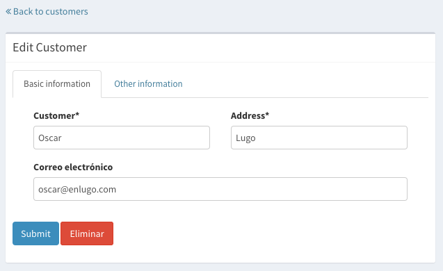
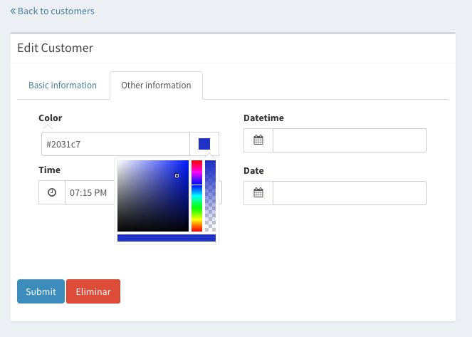
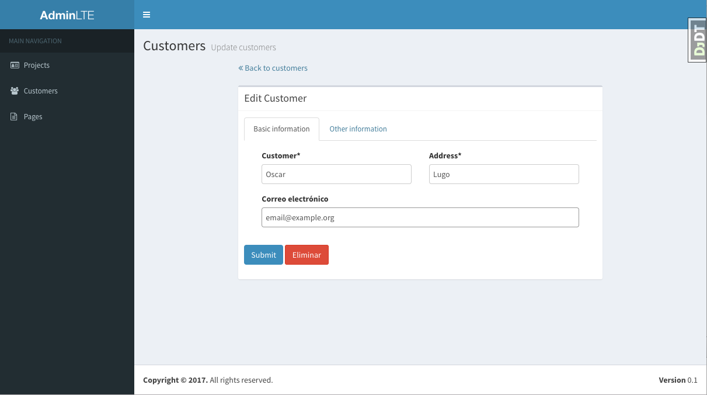

=============================
django-cruds-adminlte
=============================

* Note: This version of django-cruds-adminlte is based on `bmihelac's one <https://github.com/bmihelac/django-cruds-adminlte/>`_.

``django-cruds-adminlte`` is simple drop-in django app that creates CRUD (Create, read,
update and delete) views for existing models and apps.

django-cruds-adminlte goal is to make prototyping faster.

Documentation
-------------

To add CRUD for whole app, add this to urls.py::

    # django-cruds-adminlte
    from cruds_adminlte.urls import crud_for_app
    urlpatterns += crud_for_app('testapp')

This will create following urls and appropriate views (assuming
there is a application named ``testapp`` with model ``Author``:

===================================== =====================
URL                                   name
===================================== =====================
/testapp/author/                      testapp_author_list
/testapp/author/new/                  testapp_author_create
/testapp/author/(?P<pk>\d+)/          testapp_author_detail
/testapp/author/(?P<pk>\d+)/edit/     testapp_author_update
/testapp/author/(?P<pk>\d+)/remove/   testapp_author_delete
===================================== =====================

It is also possible to add CRUD for one model::

    from django.db.models.loading import get_model
    from cruds_adminlte.urls import crud_for_model
    urlpatterns += crud_for_model(get_model('testapp', 'Author'))

``crud_fields`` templatetag displays fields for an object::

    

    <table class="table">
      <tbody>
        
      </tbody>
    </table>

Use ``cruds_adminlte.util.crud_url`` shortcut function to quickly get url for
instance for given action::

    crud_url(author, 'update')

Is same as::

        reverse('testapp_author_update', kwargs={'pk': author.pk})

Templates
^^^^^^^^^

django-cruds-adminlte views will append CRUD template name to a list of default
candidate template names for given action.

CRUD Templates are::

    cruds/create.html
    cruds/delete.html
    cruds/detail.html
    cruds/list.html
    cruds/update.html

Templates are based in `AdminLTE2 <https://almsaeedstudio.com/themes/AdminLTE/index2.html>`_
and `django-adminlte2 <https://github.com/adamcharnock/django-adminlte2>`_. They're
ready to run with:

* `django-crispy-forms <https://django-crispy-forms.readthedocs.io/en/latest/>`_
* `select2 <https://select2.github.io/>`_
* `django-cropping-image <https://github.com/jonasundderwolf/django-image-cropping>`_

If you want to override the sidebar you can do it creating a file called
``templates/adminlte/lib/_main_sidebar.html`` inside your project and you can
put there the contents you want.

Override view with custom columns
^^^^^^^^^^^^^^^^^^^^^^^^^^^^^^^^^

If you take a look to the directory "templates/cruds/columns" you can see the
different kinds of colums depending on the type of field::

    autofield.html
    booleanfield.html
    charfield.html
    datefield.html
    datetimefield.html
    filefield.html
    textfield.html
    timefield.html

You can override the column type in lists pages with the custom html you want
for your project. Just recreate the structure (templates/cruds/columns/) in your
project and write your own html.

Override view with custom form
^^^^^^^^^^^^^^^^^^^^^^^^^^^^^^

If you want to override a form with some other crispy features you can add to
your testapp.urls the following::

    urlpatterns = []
    urlpatterns += [
        url(r'author/new/$',
            CRUDCreateView.as_view(model=Author, form_class=AuthorForm),
            name='testapp_author_update'),
        url(r'author/(?P<pk>\d+)/edit/$',
            CRUDUpdateView.as_view(model=Author, form_class=AuthorForm),
            name='testapp_customer_update'),
    ]

And define the AuthorForm with tabs or any other crispy feature in your app::

    self.helper.layout = Layout(
        TabHolder(
            Tab(
                _('Basic information'),
                Field('name', wrapper_class="col-md-6"),
                Field('address', wrapper_class="col-md-6"),
                Field('email', wrapper_class="col-md-12"),
            ),
            Tab(
                _('Other information'),
                Field('image', wrapper_class="col-md-6"),
                Field('cropping', wrapper_class="col-md-6"),
                Field('cif', wrapper_class="col-md-6"),
                Field('slug', wrapper_class="col-md-6")
            )
        )
    )

You will get something similar to this:

Crispy tabbed form sample
^^^^^^^^^^^^^^^^^^^^^^^^^

forms.py::

    class CustomerForm(forms.ModelForm):

        class Meta:
            model = Customer
            fields = ['name', 'image', 'cropping']
            widgets = {
                'image': ImageCropWidget,
            }

        def __init__(self, *args, **kwargs):
            super(CustomerForm, self).__init__(*args, **kwargs)
            self.helper = FormHelper(self)

            self.helper.layout = Layout(
                TabHolder(
                    Tab(
                        _('Basic information'),
                        Field('name', wrapper_class="col-md-6"),
                        Field('address', wrapper_class="col-md-6"),
                        Field('email', wrapper_class="col-md-12"),
                    ),
                    Tab(
                        _('Other information'),
                        Field('image', wrapper_class="col-md-6"),
                        Field('cropping', wrapper_class="col-md-6"),
                        Field('cif', wrapper_class="col-md-6"),
                        Field('slug', wrapper_class="col-md-6")
                    )
                )
            )

            self.helper.layout.append(
                FormActions(
                    Submit('submit', _('Submit'), css_class='btn btn-primary'),
                    HTML("""<a class="btn btn-danger"
                            href="{{ url_delete }}"></a>"""),
                )
            )

Cropping widget
^^^^^^^^^^^^^^^

models.py::

    from image_cropping import ImageCropField, ImageRatioField
    class Customer(models.Model):
        name = models.CharField(_('Customer'), max_length=200)
        image = ImageCropField(upload_to='media/customers', blank=True)
        cropping = ImageRatioField('image', '430x360')

forms.py::

    class CustomerForm(forms.ModelForm):

        class Meta:
            model = Customer
            fields = ['name', 'image', 'cropping']
            widgets = {
                'image': ImageCropWidget,
            }

Select2 widget
^^^^^^^^^^^^^^

By default all the select are automatically converted in select2.

DatePicker widget
^^^^^^^^^^^^^^^^^

forms.py::

    from cruds_adminlte import DatePickerWidget

    class CustomerForm(forms.ModelForm):

        class Meta:
            model = Customer
            fields = ['name', 'date']
            widgets = {
                'date': DatePickerWidget(attrs={'format': 'mm/dd/yyyy',
                                                'icon': 'fa-calendar'}),
            }

.. image:: doc/cruds-datepicker.png
    :target: https://github.com/oscarmlage/django-cruds-adminlte

TimePicker widget
^^^^^^^^^^^^^^^^^

forms.py::

    from cruds_adminlte import TimePickerWidget

    class CustomerForm(forms.ModelForm):

        class Meta:
            model = Customer
            fields = ['name', 'time']
            widgets = {
                'time': TimePickerWidget(attrs={'icon': 'fa-clock-o'}),
            }

.. image:: doc/cruds-timepicker.png
    :target: https://github.com/oscarmlage/django-cruds-adminlte

DateTimePicker widget
^^^^^^^^^^^^^^^^^^^^^

forms.py::

    from cruds_adminlte import DateTimePickerWidget

    class CustomerForm(forms.ModelForm):

        class Meta:
            model = Customer
            fields = ['name', 'datetime']
            widgets = {
                'datetime': DateTimePickerWidget(attrs={'format': 'mm/dd/yyyy HH:ii:ss',
                                                        'icon': 'fa-calendar'}),
            }

.. image:: doc/cruds-datetimepicker.png
    :target: https://github.com/oscarmlage/django-cruds-adminlte

ColorPicker widget
^^^^^^^^^^^^^^^^^^

forms.py::

    from cruds_adminlte import ColorPickerWidget

    class CustomerForm(forms.ModelForm):

        class Meta:
            model = Customer
            fields = ['name', 'color']
            widgets = {
                'color': ColorPickerWidget,
            }

CKEditor widget
^^^^^^^^^^^^^^^

forms.py::

    from cruds_adminlte import CKEditorWidget

    class CustomerForm(forms.ModelForm):

        class Meta:
            model = Customer
            fields = ['name', 'text']
            widgets = {
                'text': CKEditorWidget(attrs={'lang': 'es'}),
            }

.. image:: doc/cruds-ckeditor.png
    :target: https://github.com/oscarmlage/django-cruds-adminlte

Quickstart
----------

Install django-cruds-adminlte (`already in Pypi <https://pypi.python.org/pypi/django-cruds-adminlte>`_)::

    pip install django-cruds-adminlte

Then use it in a project, add ``cruds_adminlte`` to ``INSTALLED_APPS``. Note
that you will have to install ``crispy_forms`` and ``image_cropping`` if
before the app if you want to use them::

    pip install django-crispy-forms
    pip install easy-thumbnails
    pip install django-image-cropping

Next step is to add the urls to your ``project.urls`` as was said above::

    # django-cruds-adminlte
    from cruds.urls import crud_for_app
    urlpatterns += crud_for_app('testapp')

And you can start modeling your app, migrate it and directly browse to the urls
described above, that's all.

Requirements
------------

* Python 2.7+
* Django >=1.8
* django-crispy-forms
* django-image-cropping and easy-thumbnails (optional if you want to crop)

Screenshots
-----------

.. image:: doc/cruds-list.png
    :target: https://github.com/oscarmlage/django-cruds-adminlte

.. image:: doc/cruds-select2.png
    :target: https://github.com/oscarmlage/django-cruds-adminlte

.. image:: doc/cruds-cropping.png
    :target: https://github.com/oscarmlage/django-cruds-adminlte

.. image:: doc/cruds-responsive.png
    :target: https://github.com/oscarmlage/django-cruds-adminlte

