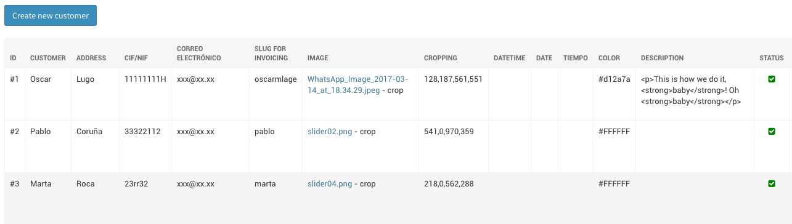
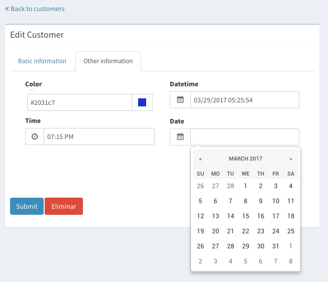
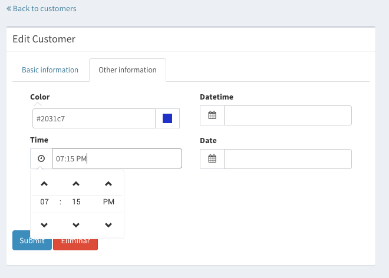
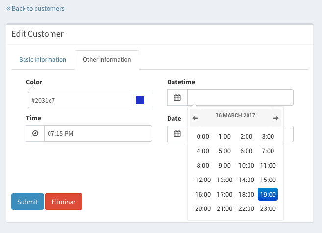
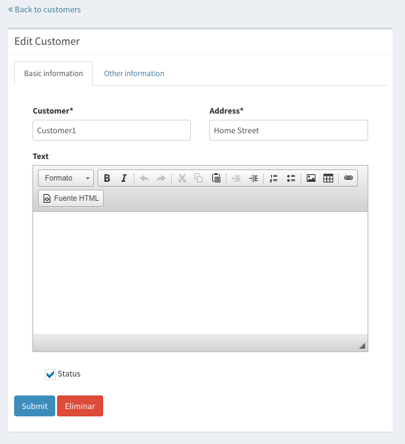

==========
Components
==========

.. _columns:

Columns
=======

If you take a look to the directory "templates/cruds/columns" you can see the
different kinds of colums depending on the type of field::

    autofield.html
    booleanfield.html
    charfield.html
    datefield.html
    datetimefield.html
    filefield.html
    textfield.html
    timefield.html

You can override the column type in lists pages with the custom html you want
for your project. Just recreate the structure (templates/cruds/columns/) in your
project and write your own html.

.. _forms:

Forms
=====

If you want to override a form with some other crispy features you can add to
your testapp.urls the following::

    from cruds_adminlte.urls import crud_for_model
    urlpatterns += crud_for_model(Author, views=['create', 'update'], 
        add_form=AuthorForm,  update_form=AuthorForm )

And define the AuthorForm with tabs or any other crispy feature in your app::

    self.helper.layout = Layout(
        TabHolder(
            Tab(
                _('Basic information'),
                Field('name', wrapper_class="col-md-6"),
                Field('address', wrapper_class="col-md-6"),
                Field('email', wrapper_class="col-md-12"),
            ),
            Tab(
                _('Other information'),
                Field('image', wrapper_class="col-md-6"),
                Field('cropping', wrapper_class="col-md-6"),
                Field('cif', wrapper_class="col-md-6"),
                Field('slug', wrapper_class="col-md-6")
            )
        )
    )

You will get something similar to this:

.. image:: images/cruds-form.png
    :target: https://github.com/oscarmlage/django-cruds-adminlte

Crispy tabbed form sample
^^^^^^^^^^^^^^^^^^^^^^^^^

forms.py::

    class CustomerForm(forms.ModelForm):

        class Meta:
            model = Customer
            fields = ['name', 'image', 'cropping']
            widgets = {
                'image': ImageCropWidget,
            }

        def __init__(self, *args, **kwargs):
            super(CustomerForm, self).__init__(*args, **kwargs)
            self.helper = FormHelper(self)

            self.helper.layout = Layout(
                TabHolder(
                    Tab(
                        _('Basic information'),
                        Field('name', wrapper_class="col-md-6"),
                        Field('address', wrapper_class="col-md-6"),
                        Field('email', wrapper_class="col-md-12"),
                    ),
                    Tab(
                        _('Other information'),
                        Field('image', wrapper_class="col-md-6"),
                        Field('cropping', wrapper_class="col-md-6"),
                        Field('cif', wrapper_class="col-md-6"),
                        Field('slug', wrapper_class="col-md-6")
                    )
                )
            )

            self.helper.layout.append(
                FormActions(
                    Submit('submit', _('Submit'), css_class='btn btn-primary'),
                    HTML("""<a class="btn btn-danger"
                            href="{{ url_delete }}"></a>"""),
                )
            )

.. _fields:

Fields
======

Cropping widget
^^^^^^^^^^^^^^^

models.py::

    from image_cropping import ImageCropField, ImageRatioField
    class Customer(models.Model):
        name = models.CharField(_('Customer'), max_length=200)
        image = ImageCropField(upload_to='media/customers', blank=True)
        cropping = ImageRatioField('image', '430x360')

forms.py::

    class CustomerForm(forms.ModelForm):

        class Meta:
            model = Customer
            fields = ['name', 'image', 'cropping']
            widgets = {
                'image': ImageCropWidget,
            }

Select2 widget
^^^^^^^^^^^^^^

By default all the select are automatically converted in select2.

DatePicker widget
^^^^^^^^^^^^^^^^^

forms.py::

    from cruds_adminlte import DatePickerWidget

    class CustomerForm(forms.ModelForm):

        class Meta:
            model = Customer
            fields = ['name', 'date']
            widgets = {
                'date': DatePickerWidget(attrs={'format': 'mm/dd/yyyy',
                                                'icon': 'fa-calendar'}),
            }

TimePicker widget
^^^^^^^^^^^^^^^^^

forms.py::

    from cruds_adminlte import TimePickerWidget

    class CustomerForm(forms.ModelForm):

        class Meta:
            model = Customer
            fields = ['name', 'time']
            widgets = {
                'time': TimePickerWidget(attrs={'icon': 'fa-clock-o'}),
            }

DateTimePicker widget
^^^^^^^^^^^^^^^^^^^^^

forms.py::

    from cruds_adminlte import DateTimePickerWidget

    class CustomerForm(forms.ModelForm):

        class Meta:
            model = Customer
            fields = ['name', 'datetime']
            widgets = {
                'datetime': DateTimePickerWidget(attrs={'format': 'mm/dd/yyyy HH:ii:ss',
                                                        'icon': 'fa-calendar'}),
            }

ColorPicker widget
^^^^^^^^^^^^^^^^^^

forms.py::

    from cruds_adminlte import ColorPickerWidget

    class CustomerForm(forms.ModelForm):

        class Meta:
            model = Customer
            fields = ['name', 'color']
            widgets = {
                'color': ColorPickerWidget,
            }

.. image:: images/cruds-colorpicker.png
    :target: https://github.com/oscarmlage/django-cruds-adminlte

CKEditor widget
^^^^^^^^^^^^^^^

forms.py::

    from cruds_adminlte import CKEditorWidget

    class CustomerForm(forms.ModelForm):

        class Meta:
            model = Customer
            fields = ['name', 'text']
            widgets = {
                'text': CKEditorWidget(attrs={'lang': 'es'}),
            }

